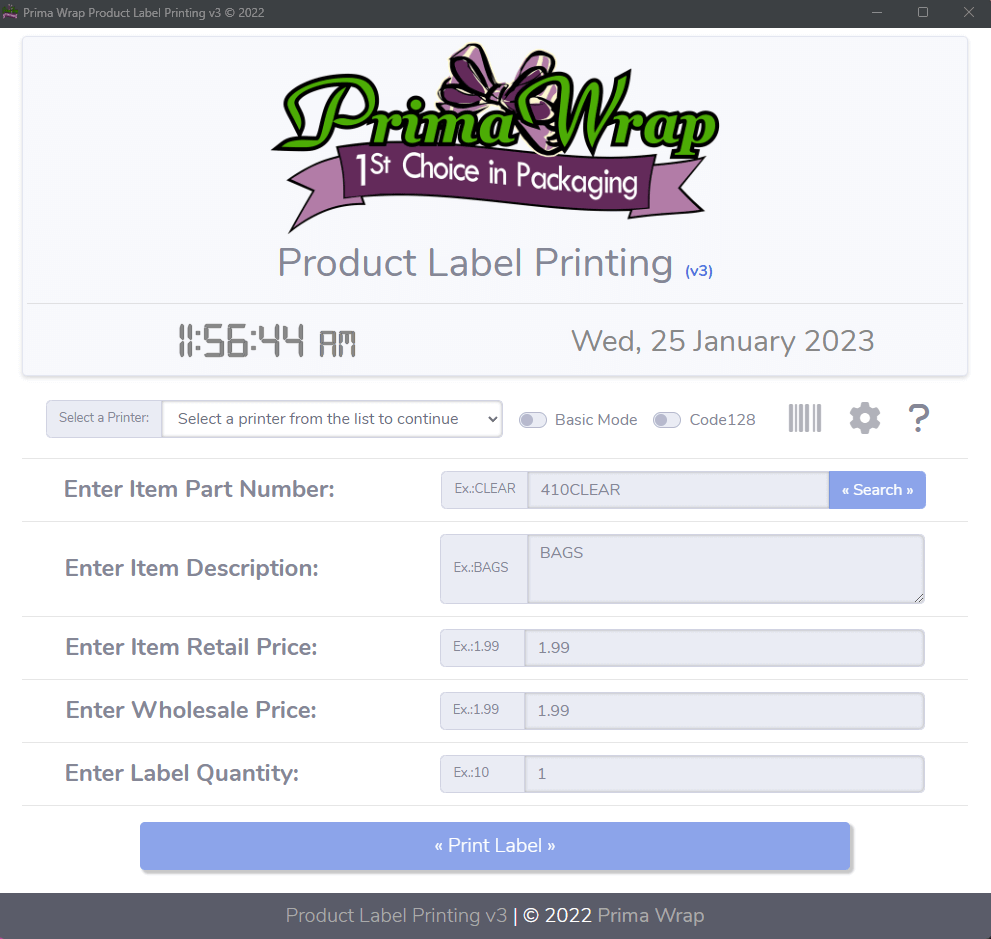

# Prima-Wrap-Product-Label-Printing-v3

<!-- PROJECT LOGO -->
 

  

<!-- ABOUT THE PROJECT -->
## About The Project

This Project was created for a company called Prima Wrap, which facilitates their local and custom inventory system, and in their own words:

"Prima Wrap is your one-stop custom gift packaging for branding corporate and wedding, including bags, boxes, cello, ribbons, eco go green products, bows and gift wrap."

* [PrimaWrap](http://primawrap.com/)

  

## Built With

* [Javascript](Javascript.com)
* [JQuery](JQuery.com)
* [Bootstrap](Bootstrap.com)
* [Python](Python.com)

(<a href="#readme-top">back to top</a>)

<!-- GETTING STARTED -->
## Prerequisites

The requirements.txt file contains a list of all the project depencies needed to run the software

## Other notes

This project makes use of the EEL python library: * [EEL](https://github.com/python-eel/Eel)

(<a href="#readme-top">back to top</a>)

<!-- LICENSE -->
## License

Distributed under the GNU General Public License v3.0. See `LICENSE.md` for more information.

(<a href="#readme-top">back to top</a>)

<!-- CONTACT -->
## Contact

Alejandro Suarez (alejandrosuarez87@gmail.com) 
Project Link: [https://github.com/alepodj/Prima-Wrap-Product-Label-Printing-v3](https://github.com/alepodj/Prima-Wrap-Product-Label-Printing-v3)

(<a href="#readme-top">back to top</a>)

